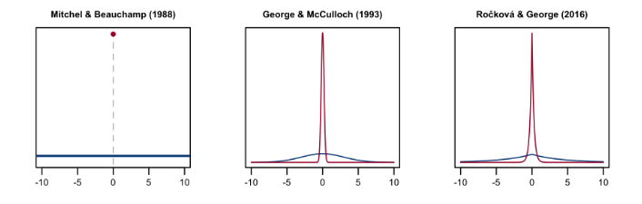

```{r setup, include=FALSE}
knitr::opts_chunk$set(echo = FALSE)
library(knitr)
```

## Outline
  - About Me
  - Bayesian Hierarchical Additive Models
  - Random Forest for Estimating Multivariate Outcome Treatment Effects 
  - Future Directions

# About me
### Education Background

- 5th-year Ph.D. candidate in BST @ UAB
 
- Dissertation: _Bayesian Hierarchical Additive Models in High Dimensional Data Analysis_
 
- Background:
  - B.S.s in Statistics and Computer Science, University of Illinois at Urbana-Champaign, 2014
  - M.S. in Statistics, UIUC, 2017
 
### Me as Person
- Born and raised in China
- 10-year in Midwest and 4-year in South
- Enjoy conversations, mentoring and leadership
- Hobbies
  - Cooking, basketball, guitar playing
  - Exploring personal identity

### Me as Statisticitian
:::::::::::::: {.columns}
::: {.column width=.05}
\ 
:::

::: {.column width=.7}
- A good collaborative biostatistician
- 5-year experience as statistical consultant (pre-doctoral level)
- [the Reason for Geographic and Racial Difference in Stroke study](https://www.uab.edu/soph/regardsstudy/)
- Exposure to many Epidemiology concepts, collaboration with physicians
  - Case-cohort design, Mediation analysis, administrative side of a study
:::

::: {.column}
```{r out.height='50%', fig.align='center'}

```
:::

::: {.column width=.05}
\ 
:::
::::::::::::::

### Me as Methdologist
:::::::::::::: {.columns}

::: {.column width=.05}
\ 
:::

::: {.column width=.5}
- Bayesian hierarchical models
  - High-dimensional data analysis
  - Scalability via optimization algorithms
- Supervised Learning
  - Generalized additive models
  - Random forests
- Predictive Modeling
:::

::: {.column}
```{r, out.height='40%', out.width='100%', fig.align='center', fig.cap = "Densities of Spike-and-slab priors"}

```
<!-- # ```{r out.height='40%', fig.align='center'} -->
<!-- # include_graphics("RF.png") -->
<!-- # ``` -->
:::
::::::::::::::

# BHAM {.unlisted}
```{r child = "02-BHAM.Rmd"}
```


# MOTE RF
### Motivation
A dietary study on the health benefit of consuming whole almond versus processed almond

  - Balanced two-arm randomized trial 
  $$ A \in \mathcal{A} = \{-1, 1\}, Pr(A=1) = Pr(A=-1) = 0.5, A \indep \bs X $$ 
  - Microbiomes ($\bs X$) and Biomarkers ($\bs Y$) are measured pre- and post- intervention, denoted with superscripts $b, e$
  $$\{(\bs X_i^b, \bs Y_i^b, A, \bs X_i^e, \bs Y_i^e)\}^n_{i=1}$$

How to model individualized treatment effect given the baseline microbiome data?
$$
E(\Delta \bs Y_{(A=1)} - \Delta \bs Y_{(A=-1)}| \bs X^b),
$$
where $\Delta \bs Y = \bs Y_i^e - \bs Y_i^b$

### Challenges
- Treatment effects are not directly observable
- Complexity of underlying signals
  - Relaxation of the linear assumption
- Joint modeling of multivariate outcome
- Correlation structure among predictors and outcomes
- Exploit the pre- and post- measurements for enhanced estimation accuracy
  - With assumptions

### Assumptions

\begin{figure}[!h]
  \scalebox{0.85}{
    \centering
    \begin{tikzpicture}[node distance=2cm]
    \tikzstyle{arrow} = [ultra thick,->,>=stealth]
    \node[rectangle, minimum width=3cm, minimum height=1cm, text centered, draw=black, fill=orange!30](PTX){Pre-treatment Covariate $\bm{X}^b$};
    \node[rectangle, minimum width=3cm, minimum height=1cm, text centered, draw=black, fill=orange!30, below of=PTX](PTY){Pre-treatment Response $\bm{Y}^b$};
    \node[rectangle, minimum width=3cm, minimum height=1cm, text centered, draw=black, fill=orange!30, 
    right of=PTX, xshift=5cm
    ](ATX){Post-treatment Covariate $\bm{X}^e$};
    \node[rectangle, minimum width=3cm, minimum height=1cm, text centered, draw=black, fill=orange!30, below of=ATX](ATY){Post-treatment Response $\bm{Y}^e$};
    \draw[arrow] (PTX)-- node[anchor=east]{$\bm g(\bm X^b)$} (PTY);
    \draw[arrow] (PTX)--node[anchor=south]{Treatment $A$} node[below] {$\bm f(\bm X^b, A)$}(ATX);
    \draw[arrow] (ATX)--node[anchor=west]{$\bm g(\bm X^e)$}(ATY);
    \end{tikzpicture}
    }
\end{figure}

- Link function $\bs g(\cdot): \mathcal{X} \rightarrow \mathcal{Y}$    
- Treatment effect function $\bs f(\cdot, \cdot): \mathcal{X} \times \mathcal{A} \rightarrow \mathcal{X}$

## Multivariate Random Forest

- Random forest framework for flexible signal estimation
  - Recursive partitioning of sample space
  - Similar treatment effect within each internal node
- Modified outcomes $\Delta \bs Y A$ as response of the proposed model
  $$
  E(\Delta \bs Y A|\bs X^b) = E(\Delta \bs Y| \bs X^b, A=1) - E(\Delta \bs Y| \bs X^b, A=-1)
  $$
- Oblique splitting rule
  - A linear combination of predictors, $\bs \alpha ^T \bs X^b$, as _splitting variable_
  - Variance reduction on a pusdo-response, i.e. dimension-reduced modified outcomes, $\bs\kappa^T\Delta \bs Y A$
  - Two vectors, $\bs\alpha$ and $\bs\kappa$, are calculated locally using  multi-block Canonical Correlation Analysis (CCA)
  
### Multi-block Canonical Correlation Analysis
When the assumed link function $\bs g(\bs X)$ and treatment effect function $\bs f(\bs X^b, A)$ are linear,
$$
E(\Delta \bs Y A|\bs X^b) = \bs \Gamma E(\Delta \bs X A|\bs X^b)  = 2 \bs \Gamma \bs B \bs X^b
$$

  - Linear assumption are relaxed by random forest framework

CCA are used to find the solution space where the treatment effects are 
\begin{align*}
\{\bm{\widehat{\alpha}}, \bm{\widehat{\beta}}, \bm{\widehat{\kappa}}\} = & \argmax\limits_{\lVert\alpha\rVert^2 = \lVert\beta\rVert^2 = \lVert\kappa\rVert^2 = 1}
\Big[ \text{cov}( \bm \alpha\trnp \bm{X}^b, \bm \beta \trnp \Delta \bm{X} A ) + \nonumber \\ 
&\quad \text{cov} (\bm \alpha\trnp \bm{X}^b, \bm \kappa \trnp \Delta \bm{Y} A) +\text{cov}(\bm \beta\trnp \Delta \bm{X} A, \bm \kappa\trnp \Delta \bm{Y} A ) \Big] \label{eqn:multiblock}
\end{align*}

  - Pre- and post- measurements regularize CCA solution space 


### Conclusion
- The proposed methods outperforms $L_1$ penalized models and marginal RF when the signals are non-linear
- R package [MOTE.RF](https://github.com/boyiguo1/MOTE.RF) on GitHub
- Limitations:
  - Only applies to randomzied trial with two interventions
  - Would not work well when number of predictors are large

# Future Directions

### Integrative Analysis
- Variable selection
  - Integration of external biology information
  - Bi-level selection problem in multimodal learning

- Prognostic modeling
  - Integrating -omics data with clinical data


### Random Forests for -Omics Data Analysis
- Assessment of classical random forests in $p>>n$ settings
  - Tuning parameters' effect on prediction performance
  - Variable importance
  
- Integrative random forests via regularized oblique splitting
  - Improved prediction and variable importance


### Expectation
- Develop impactful research
  - Hands-on experience
  - Problem-forward research
- Advanced training in R package development with emphasis in Bioconductor packages
- Foster strong relationship with everyone
- More collaborations

# Closing Remarks

Taken from my 2015 personal statement of the rejected JHU Ph.D. application
\  

\  

> The missions honored by the biostatistics program at Johns Hopkins University resonate with my eagerness to accomplish my lifetime goal in academia. ...  The Center for Computational Biology will offer me an abundance of opportunities to gain hands-on experience in solving real-world biostatistical problems... Johns Hopkins sets up the platform for broadening my horizon of research as well as expanding my network for future collaborations. I strive to live up my promise in the pursuit for distinction.


## Appendices
### BHAM Simulation Study {.unlisted .unnumbered}
* Follow the data generating process introduced in @Bai2020. 
* $n_{train} = 500$, $n_{test}=1000$
* $p=4, 10, 50, 200$
$$
\mu = 5 \sin(2\pi x_1) - 4 \cos(2\pi x_2 -0.5) + 6(x_3-0.5) - 5(x_4^2 -0.3),
$$

* $f_j(x_j) = 0$ for $j = 5, \dots, p$.
* 2 types of outcome: Gaussian ($\phi=1$), Binomial
* Splines are constructed using 10 knots
* 50 Iterations

### Comparison & Metircs {.unlisted .unnumbered}
* Methods of comparison
  * Proposed model with EM-CD and EM-IWLS
  * mgcv [@Wood2004]
  * COSSO [@Zhang2006GAM] and adaptive COSSO[@Storlie2011]
  * Sparse Bayesian GAM [@Bai2021]

* Metrics
  * out-of-sample $R^2$ for continuous outcomes
  * out-of-sample AUC for binary outcomes
  
### Out-of-sample AUC {.unlisted .unnumbered}

* The proposed method works better in low, medium, high settings than other state-of-art methods
* SB-GAM works better in ultra-high setting

\begin{tabular}{r|l|l|l|l|l|l}
\hline
p & EM-IWLS & EM-CD & COSSO & ACOSSO & mgcv & SB-GAM\\
\hline
4 & \textbf{0.94 (0.01)} & 0.89 (0.04) & 0.90 (0.02) & 0.90 (0.02) & 0.94 (0.01) & 0.93 (0.01)\\
\hline
10 & \textbf{0.93 (0.01)} & 0.87 (0.03) & 0.87 (0.03) & 0.85 (0.03) & 0.92 (0.04) & 0.92 (0.01)\\
\hline
50 & \textbf{0.92 (0.01)} & 0.87 (0.02) & 0.83 (0.02) & 0.83 (0.02) & 0.76 (0.04) & 0.92 (0.01)\\
\hline
200 & 0.88 (0.01) & 0.86 (0.02) & 0.81 (0.06) & 0.81 (0.08) & - & \textbf{0.92 (0.01)}\\
\hline
\end{tabular}  

# References {.allowframebreaks}
